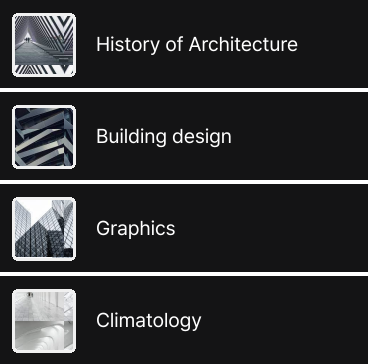

# 리액트 프로그래밍

### ✏️ 개발 핸드오프 실습

#### 1. 과제 수행 방법

- `ul`태그와 `li`태그를 통해 의미있는 구조 설계를 하였습니다
- `alt` 속성값을 넣어 접근성을 높혔습니다
- BEM방식을 통해 가독성과 유지보수성을 높혔습니다
   

#### 2. 난관 및 해결 방법

##### 2-1 난관

컴포넌트에 키보드 컨트롤이 가능하게 하기 위해 어떤 속성값을 적용해야 할지 고민했습니다

##### 2-2 해결 방법

chatGPT를 통해 검색하여 tabindex 속성을 넣어주었으며 이를 통해 컴포넌트에 포커스가 가도록 하였습니다
 

#### 3 피그마 시안 이미지

